## Website description
ORGANISATION OVERVIEW:
                      AFRICA UNCOVERED:
AFRICA, a continent known for it’s beauty in nature, has an incredible remarkable record of wildlife including the big five, many different cultures, marks of historical events and being rich in valuable minerals.  Having all this beauty, this makes it to be a place whereby attracts tourist all over the world, for them to witness the beauty of African and not to be just told or just hear about it. 
All this led to the creation of the website AFRICA UNCOVERED.

## Website goal and objective
MISSION:
Our mission is to help tourists to get a virtual view of southern Africa before deciding on which country to explore and be able to decide on to which country in southern part of africa they would like to visit.

VISION:
Our vision is to allow Africa to be known for its beauty. This website will also increase the number of tourists visiting Africa by promoting and encouraging the beauty of southern Africa.
      
TARGET AUDIENCE
 This website has been designed for tourists and people who want to learn more about southern
 Africa.

## Timeline and milestone

STEPS:              |TASKS:	                                  |DURATION:
Planning.           |Gathering content, mind-map.             | 1-week 
                    |Layout-graphics.                         |	2-weeks 
Development.	      |Coding-designing.	                      | 3-weeks 
Testing.	          |Functionality,responsiveness, security.  | 2-weeks 
Launch. 	          |Promote.	                                | 1-week 
TOTAL		            |                                         |10-weeks 

## Features and functionality
- index.html --> home page (entry point)
- about.ihtml --> website background information
- services.html --> all services provided
- contact.html --> contact details 
- enqiries.html --> communication 

## Structure
africa-tourism-website/
|____ assets/
|     |______css/
|     |      |___style.css
|     |______js/
|     |     |__about.js
|     |     |__contact.js
|     |     |__countries.js
|     |     |__enquiry.js
|     |     |__script.js
|     |
|     |_____ fonts/
|     |     |____.ttf/
|     |     |____.woff/
|     |     |____.woff2/
|     |__ images/
|     |__ media/
|____ pages/
|   |__ zimbabwe.html
|   |__ south-africa.html
|   |__botswana.html
|   |__ lesotho.html
|   |__ eswatini.html
|__services.html  
|__contact.html 
|__enquire.html 
|__ about.html
|__ index.html
|___miscellaneous/
    |__ README.md

## respond functionality 

- navigation bar on smaller devices.
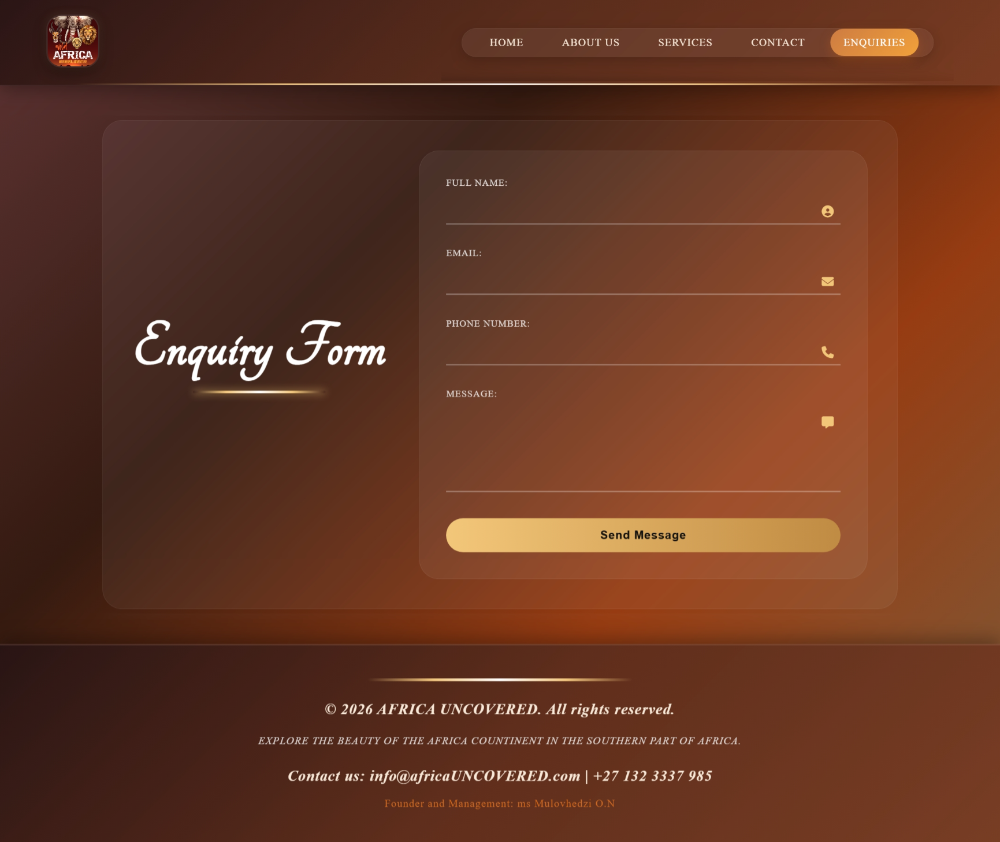

- live realTime
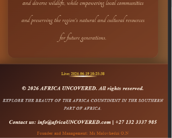

- Interactive buttons for .welcome-container class
 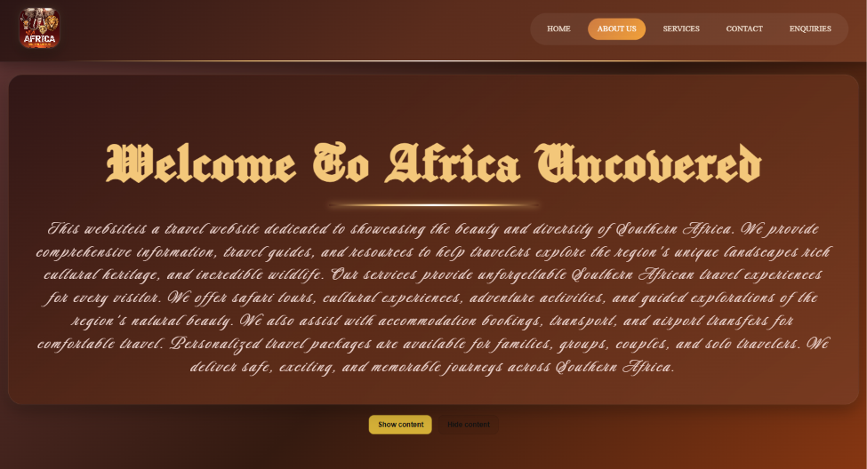

- Clicking a heading should show only the content that belongs to that heading. in countries
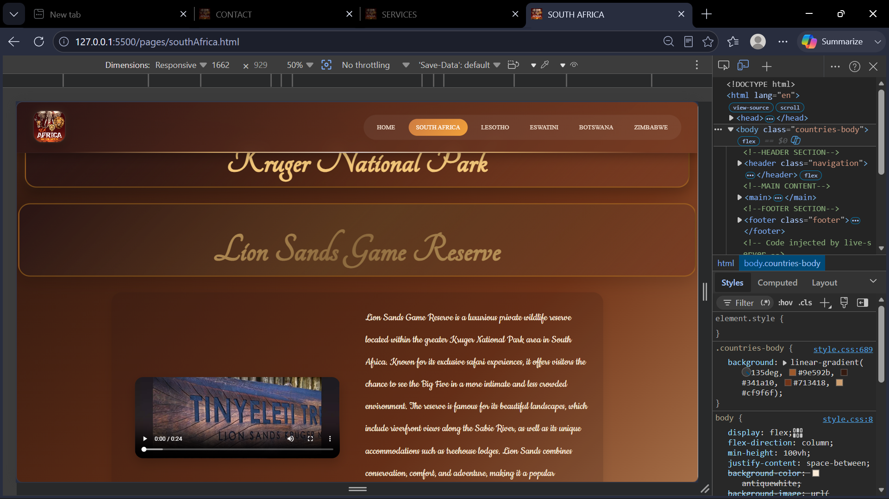

-  Lightbox for .visual images/videos (click to view larger). Works only if there are elements to click.
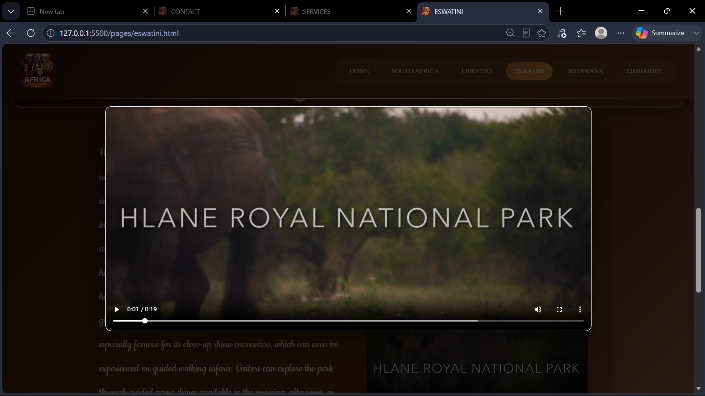

-  Google interactive map
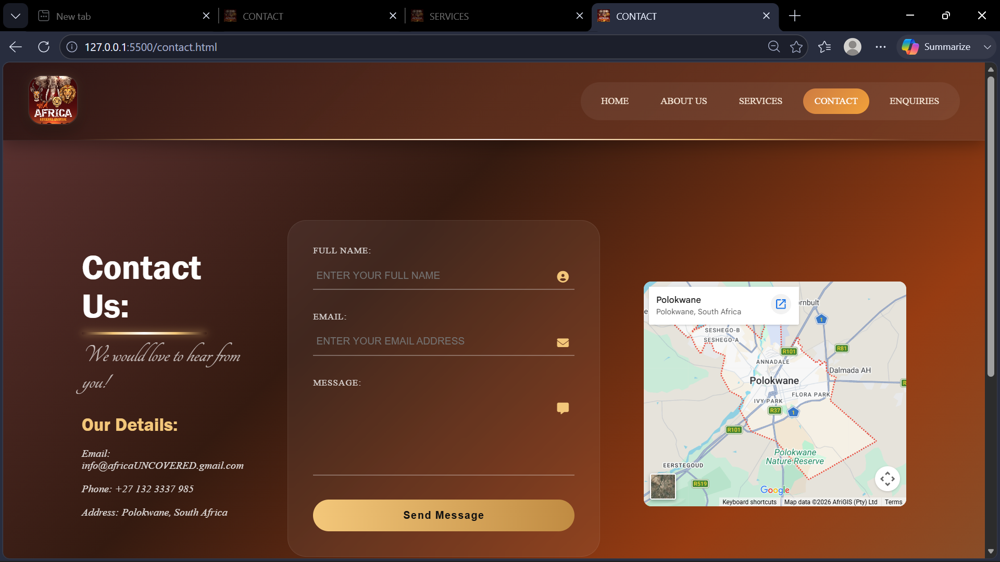

- form validation showing different messages 
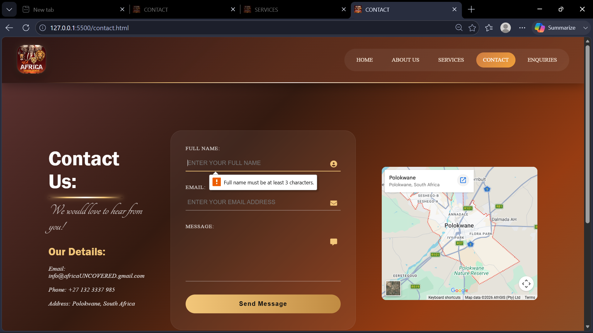
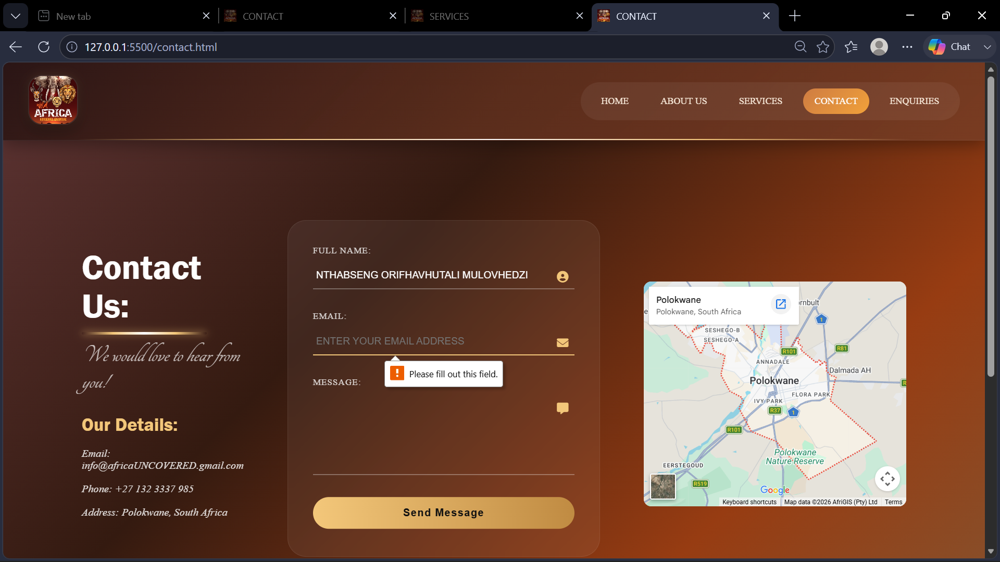
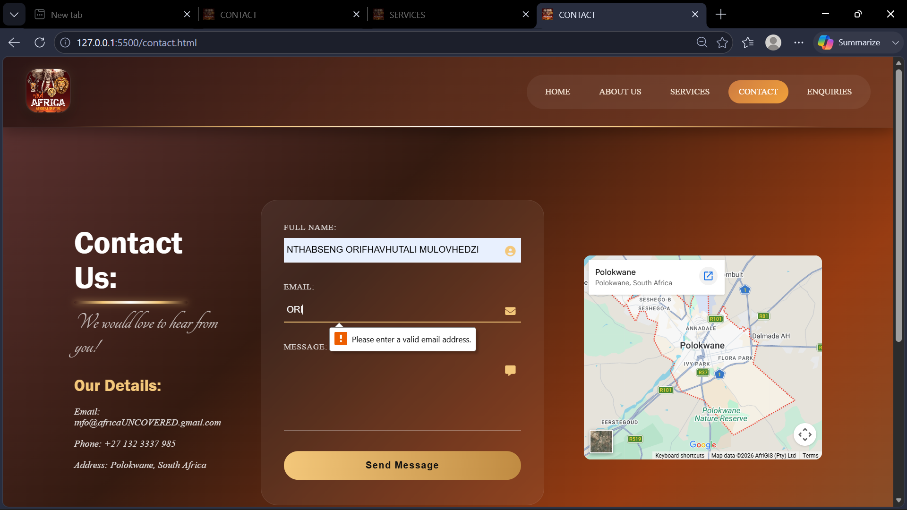
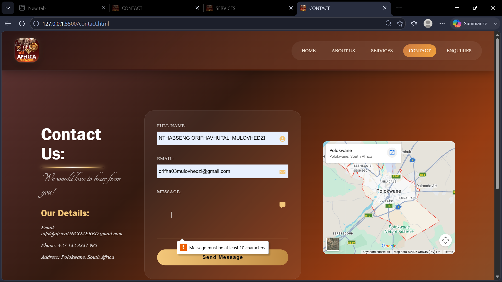
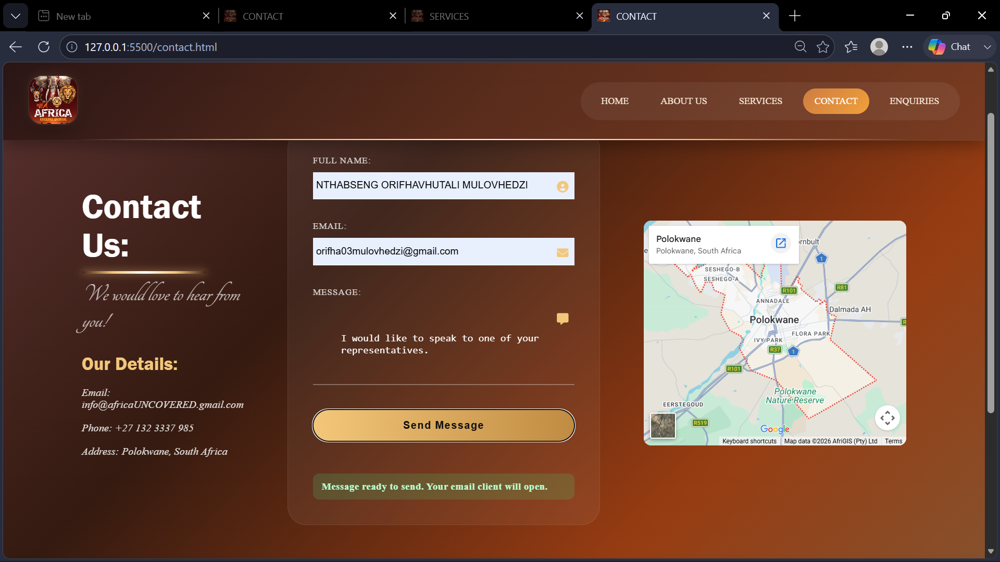
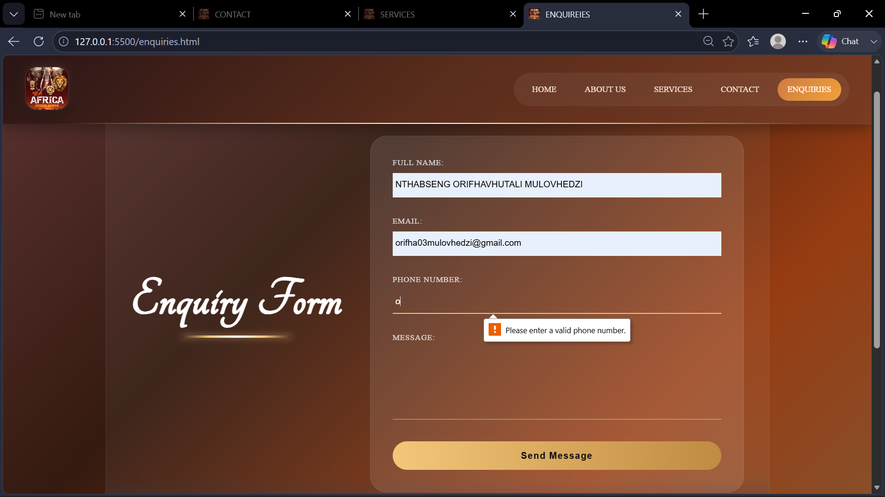

- Flag and desciption entrance animation on page open, in countries
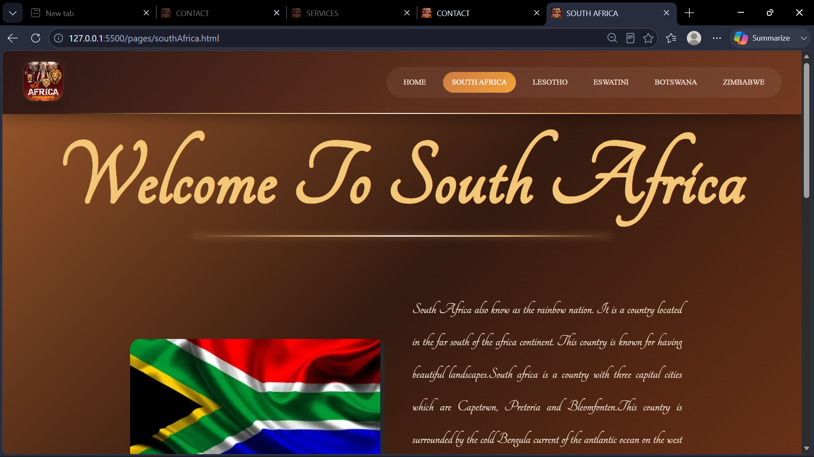

- entrance amination on contact text 
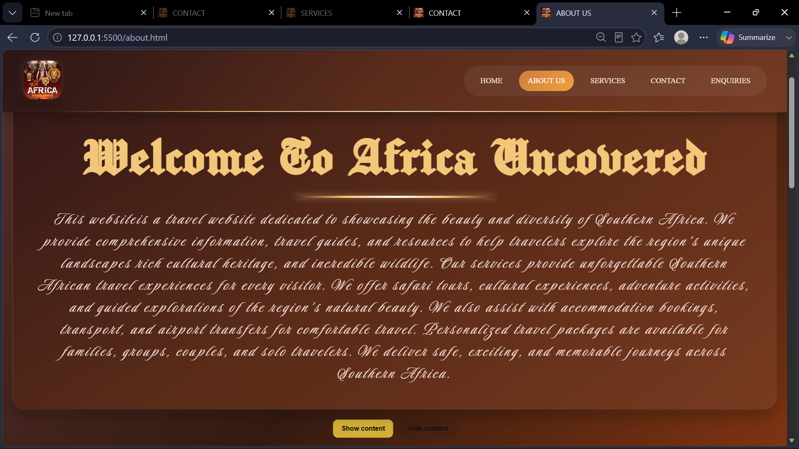
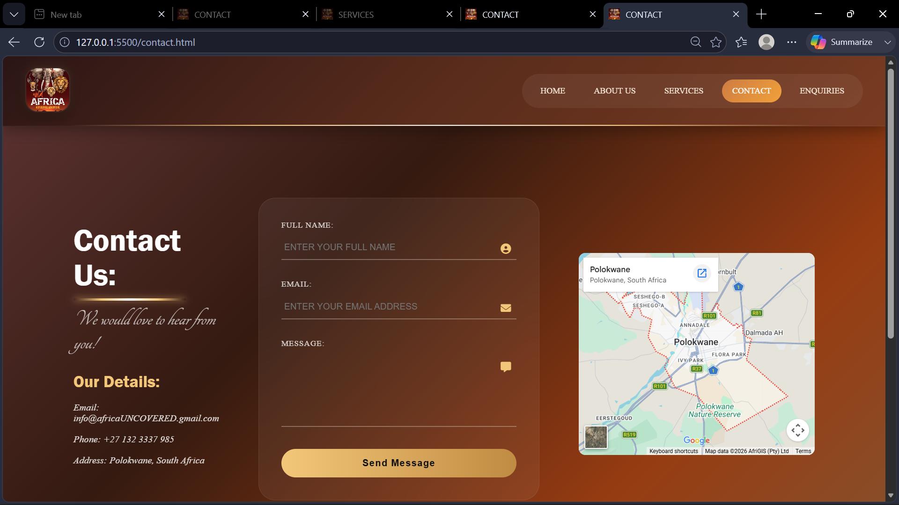

## Deploying website

 STEP 1: Build or Prepare Your Website

- Create your website using HTML, CSS, JavaScript, or a framework such as React, Next.js, or Vue.js.
- Test it locally to ensure everything works correctly.

STEP 2: Choose a Hosting Platform
Common options include :

- [Netlify](https://www.netlify.com?utm_source=chatgpt.com) (great for static websites)
- [Vercel](https://vercel.com?utm_source=chatgpt.com) (excellent for Next.js and frontend apps)
- [GitHub Pages](https://pages.github.com?utm_source=chatgpt.com) (free for static sites)
- [Cloudflare Pages](https://pages.cloudflare.com?utm_source=chatgpt.com) (fast and free for many projects)
- [Amazon Web Services (AWS)](https://aws.amazon.com?utm_source=chatgpt.com) (scalable for larger applications)

STEP 3: Register a Domain Name (Optional)
Purchase a custom domain from providers such as:

- [Namecheap](https://www.namecheap.com?utm_source=chatgpt.com)
- [GoDaddy](https://www.godaddy.com?utm_source=chatgpt.com)
- [Cloudflare Registrar](https://www.cloudflare.com/products/registrar/?utm_source=chatgpt.com)

STEP 4: Upload or Connect Your Code
There are usually two methods:

- Connect a Git repository (e.g., from [GitHub](https://github.com?utm_source=chatgpt.com)).
- Upload the built website files manually.

STEP 5: Configure Build Settings
For framework-based websites:

- Specify the build command (e.g., `npm run build`).
- Specify the output folder (e.g., `dist`, `build`, or `.next`).

STEP 6. Configure Domain and DNS
If using a custom domain:

- Add the domain in your hosting dashboard.
- Update DNS records at your domain registrar according to the hosting provider's instructions.

STEP 7. Enable HTTPS
Most modern hosts provide free SSL certificates automatically, giving your site a secure `https://` URL.

STEP 8: Test the Live Website
Verify:

- Pages load correctly.
- Images and assets display properly.
- Forms and APIs work.
- Mobile responsiveness.

STEP 9: Set Up Continuous Deployment (Recommended)
Connect your Git repository so every push to your main branch automatically redeploys the website.

- Example: Deploy a Static Website with Vercel
1. Push your code to GitHub.
2. Sign in to [Vercel](https://vercel.com?utm_source=chatgpt.com).
3. Click **New Project**.
4. Import your GitHub repository.
5. Click **Deploy**.
6. Receive a live URL in a few minutes.

## Installation/how to run

## Dependencies

## Changelog
25/03/2026
- Added new and relevant images on respective pages.
- Added a multimedia for the "South africa" page, under Kruger National Park.
- contact page  content added 
- organisation history, mission and vision  added. under about us

26/03/2026
- added "eswatini" web page
- footer content added in about page, contact page, services and south africa page
- edits in vision and mission in about page 

27/03/2026
- eswatini added navigation menu in services page
- namibia file has been added under pages folder
- logo added in navigation
- header has been add in namibia page
- sytle added in footer under about, contact, services and south africa pages
- navigation and logo has been added under namibia page 
- logo added in index,south africa, lesotho, botswana, contact and service pages
- size of flag images of south africa, botswana and lesotho edited
- four images added to images folder
- images added in about us page 
- two images added in lesotho page 
- footer added under lesotho page
- namibia was replaced by zimbabwe
- video added in media file  
- multi-media was added under zimbabwe

28/03/26
- footer was added in zimbabwe page 
- edits in the safari adventure of botswana 
-  multi-media added under botswana page 
- footer added under botswana
- enquiries file added 
- footer added in enquiries page 
- enqiuries links added in all pages 

29/03/26
- multi-media added under eswatini page 

30/03/26
- links of social media platforms added footer in all pages 

01/04/26
- edits nav in the footer for all pages 

10/04/26
- alignment and addition of tags under index and south africa pages 

12/04/26
- alignment of tags in services and lesotho
- removal of class in south africa page
- changes in image of index page 
- changes in image of services page

16/04/26
- alignment tags in all pages

17/04/26
- style removed on footer under index

18/04/26
- changes in logo in all pages 
- multi-media added in assests under media folder 
- media added under zimbabwe 
- images added in miscellaneous folder 
- closing tag div added in footer

20/04/26
- images added in miscellaneous folder

21/04/26
- comments added in all pages 

27/04/26
- stlye.css added under assets folder in css folder
- main image changes 
- backgound color added on body 
- background image add on body
- background color added in navigation 
- logo size and radius changed 
- background color added in footer 
- font style added in footer
- font size edited in introduction

28/04/26
- background on footer and navigatio added in services page
- horizontal layout of navigation bar in services 
- added image in the center of the servcies landing page
- footer colour changed in all pages 
- mission, vission, history grid cards created
- background color and fonts in mission, vission and history applied 

30/04/26
- margin in body edited
- margin, background colour, border-radius added in contact form
- margin , font style , color added in contact heading  and mini message in contact heading  under contact page 

02/05/26
- margin, history and vision was added font family and margin adjustment 
- gap size was added in the about cards
- class tags added in about.html

03/05/26
- navigation bar added on in contact and enquiries pages
- navigation bar deco added in south africa page under services 

06/05/26
- margin of the whole website changed
- classes tag added in south Africa page 
- size added in multi-media in south africa page 

07/05/26
- multi media  size adjusted in all service countries 

08/05/26
- enqiuries and contact form background colour added with hover, active affects and fonts styling 
- logo size adjusted in all pages 

09/05/26
- hover and background colour added in contact and enqiury botton
- padding added in navigation
- background colour changed
- logo image hover added rotation 

10/05/26
- background colour was changed in lesotho page 
- navigation bar background color was changed 

11/05/26
- flags size images were changed in countries pages 

15/05/26
- added favicon in header of all pages 

22/05/26
- transition added in nav links 
- grid added in services page
- border style added in main content in about services page 

23/05/26
- background colour changed in enqiures 
- main title of enqiuries font changed

24/05/26
- responsive system added for all elements 

25/05/26
- responsive system added on navigation bar

27/05/26
- fontAwesome link added in the head in contact page and enquires pages 

28/05/26
- .ttf ,.wff, .wff2 folders were added in the font folder under assets 
- .ttf was added fonts 

29/05/26
- responsive system added all elemnt tag
- font added in .ttf folder 
- background colour changed in about page 
- font changed in enquiry heading 
- font and color changed in aboutus content 

15/06/26
- action added in navigation hamburger 
- siding feacture added in navigation feature
- Ensured the mobile menu actually becomes visible when toggling

16/06/26
- Flag entrance animation on page open (smooth left -> right). Only runs once when the page loads.
- Paragraph of country description entrance animation on page open (smooth right -> left). Only runs once when the page loads.

17/06/26
- countries pages: click a .heading and reveal only its matching content
- Hide all .content and .visual initially
- Clicking a .heading should show only the .content that belongs to that heading

18/06/26
- Realtime footer timestamp (center + gold)
- Lightbox for .visual images/videos (click to view larger). Works only if there are elements to click.
- Contact form validation rules
- Recipient processing added (use email field as recipient if provided, otherwise fallback)
- in contact, Google interactive map (embed-free JS via iframe) - Polokwane, South Africa
- Animate contact text container on page load (left -> right), in contact pages 
- Interactive buttons for .welcome-container class
- 

## References
- Reserve, L. S. G., 2016. travelplusstyle. [Online] 
  Available at: https://www.travelplusstyle.com/wp-content/gallery/lion-sands-private-game-reserve/fisheaglevillapoolfiredeck-060338.jpg

- bing.com, 2025. bing.com. [Online] 
  Available at: https://www.bing.com/images/search?q=&view=detailv2&id=D93AC6178A9AAE382000A6D23C23AB7723DF713A&ccid=x+Vusg8T&iss=fav&FORM=SVIM01&idpview=singleimage&mediaurl=https%253a%252f%252fa-z-animals.com%252fmedia%252f2022%252f11%252fshutterstock_1896930640.jpg&ex

- Gumede, R., 2018. buzz south africa. [Online] 
  Available at: https://buzzsouthafrica.com/interesting-facts-about-south-african-flag/

- musyafa, H., 2023. dreamstime. [Online] 
  Available at: https://www.dreamstime.com/collection-flag-icons-countries-southern-african-continent-flags-southern-african-countries-flags-south-africa-image326509728https://www.dreamstime.com/collection-flag-icons-countries-southern-african-continent-flags-southern-af

- Reserve, L. S. G., 2016. travelplusstyle. [Online] 
  Available at: https://www.travelplusstyle.com/wp-content/gallery/lion-sands-private-game-reserve/fisheaglevillapoolfiredeck-060338.jpg

- safari.com, 2022. safari.com. [Online] 
  Available at: https://www.safari.com/rewrite/cdn.prod.website-files.com/636e23f049cf12406b2feccd/6386cb83f4b309194cd7c98d_7_3-day-lion-sands-sabi-sand-safari.jpeg

- Art, K. M. P., 2024. shutterstock. [Online] 
  Available at: https://www.shutterstock.com/image-vector/sunset-wildlife-illustration-elephants-giraffes-birds-2523064363

- Seamartini, n.d. vectorstock. [Online] 
  Available at: https://www.vectorstock.com/royalty-free-vectors/safari-animals-vectors
  [Accessed 15 August 2015].

- Tradition, V., n.d. stock.adobe. [Online] 
  Available at: https://stock.adobe.com/za/images/african-animals-vector-poster-for-safari-adventure/166155507
  [Accessed 13 January 2023].

- Fernando2408, 2019. Wallpaper cave. [Online] 
  Available at: https://wallpapercave.com/eswatini-flag-wallpapers

- Seamartini, n.d. vectorstock. [Online] 
  Available at: https://www.vectorstock.com/royalty-free-vectors/safari-animals-vectors
  [Accessed 15 August 2015].

- Tn, V., n.d. stock.adobe. [Online] 
  Available at: https://stock.adobe.com/za/images/african-animals-vector-poster-for-safari-adventure/166155507
  [Accessed 13 January 2023].

- Deuchle, D., 2020. victoriasProduction. [Online] 
  Available at: https://youtu.be/H0LG5rOo_9w?si=nLzwNsmOFQJhMber
  [Accessed 04 may 2020].

- Hormeyr, R., 2018. RelaxationChannel. [Online] 
  Available at: https://youtu.be/DWorPenlAKk?si=pCIZW1ZTcBJK4oQj
  [Accessed 01 march 2018].

- Robergg, 2020. worldwildhearts. [Online] 
  Available at: https://youtu.be/o40hh1AL_PE?si=QxNzvLtFHfGmGrui
  [Accessed 05 march 2020].

- Adams, V., 2016. google fonts. [Online] 
Available at: https://fonts.google.com/specimen/Niconne?categoryFilters=Feeling:%2FExpressive%2FFancy&preview.script=Latn

- Brennan, F., 2019. google fonts. [Online] 
Available at: https://fonts.google.com/specimen/Manufacturing+Consent?categoryFilters=Feeling:%2FExpressive%2FFancy&preview.script=Latn

- Fontstage, n.d. 2020. [Online] 
Available at: https://fonts.google.com/specimen/Felipa?categoryFilters=Feeling:%2FExpressive%2FFancy&preview.script=Latn

- Leuschke, R., 2019. google font. [Online] 
Available at: https://fonts.google.com/specimen/Luxurious+Script?categoryFilters=Feeling:%2FExpressive%2FFancy&preview.script=Latn

- Leuschke, R., 2026. GOOGLE FONTS. [Online] 
Available at: https://fonts.google.com/specimen/Mea+Culpa?categoryFilters=Feeling:%2FExpressive%2FFancy&preview.script=Latn

- Omnibus-Type, M. S., 2020. google fonts. [Online] 
Available at: https://fonts.google.com/specimen/Ballet?categoryFilters=Feeling:%2FExpressive%2FFancy&preview.script=Latn

